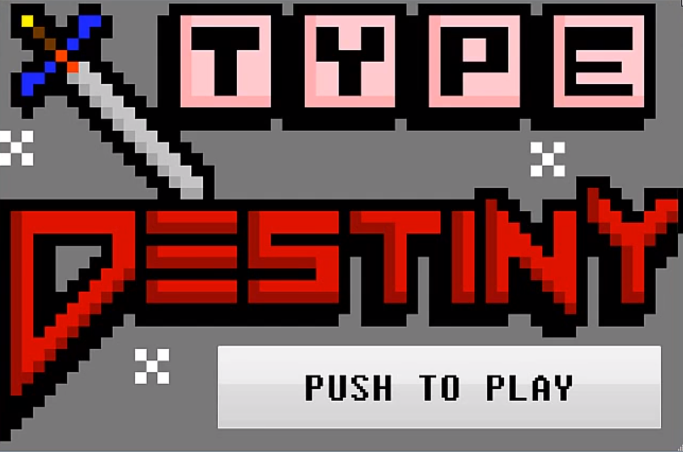

# Type-Destiny
A Highschool Sophomore Computer Science II final project. Using the QT Visual IDE based in C++, I created an interactive typing-combat game. You can view an in-depth overview of the documentation and design philosophies of this project [at this link](https://www.youtube.com/watch?v=jg_Cd2k9jVw "Documentation") or view a demo of the project [at this timestamp](https://youtu.be/jg_Cd2k9jVw?t=171) if you do not wish to view the introduction.

# Type-Destiny
A Highschool Sophomore Computer Science II final project. Using the QT Visual IDE based in C++, I created an interactive typing-combat game. You can view an in-depth overview of the documentation and design philosophies of this project [at this link](https://www.youtube.com/watch?v=jg_Cd2k9jVw "Documentation").

  

## Design Philosophy
Our final project for this  introductory C++ class was to create any functional application that utilizes a visual UI. Examples of acceptable submissions include a calculator, calendar app, etc. Though I had never used the QT IDE or been exposed to object oriented programming, I wished to challenge myself and combine my passions for programming and gaming. 

Because of the limited time provided to complete this project, I had to design a game that would be simple to implement and wouldn't require extensive knowledge of animation, collision detection mechanics, etc. Thus, a project that solely used keyboard input and minimal processing allowed me to focus on the core mechanics of my gameplay while at the same time not getting headaches from biting off more than I could chew.

## Problems encountered
Because of my limited knowledge of object oriented programming and data structures, I had to utilize many work arounds in order to complete this project. Namely, rather than using the *struct* data type in order to populate the characters onto the screen or define new enemy types, I resorted to using an embarassingly large amount of if/case statements and loops to achieve the same gameplay checks that I needed.

Additionally, working with a new IDE and compiler proved difficult when answers were few and far between. Compilation errors, IDE bugs, and random crashes plagued my project and required me to make multiple copies of my project and reinstall QT more than a couple times to fix the issue. 

## Closing Thoughts
With this project, I was first exposed to what it meant to be a resourceful programmer. By choosing a project that I was passionate about and pushed my current knowledge on the subject, I was forced to utilize my resources -- the internet, my peers and experts -- to succeed. Even years later, this is the project I'm most proud of. Though my logical and technical skills have improved, the pure passion and effort put into this project only shows what I'm capable of when I put my mind into it.
